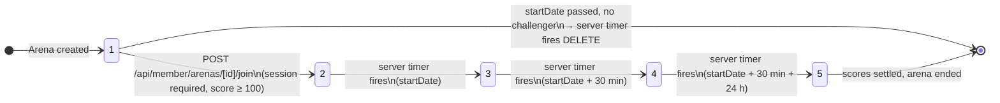
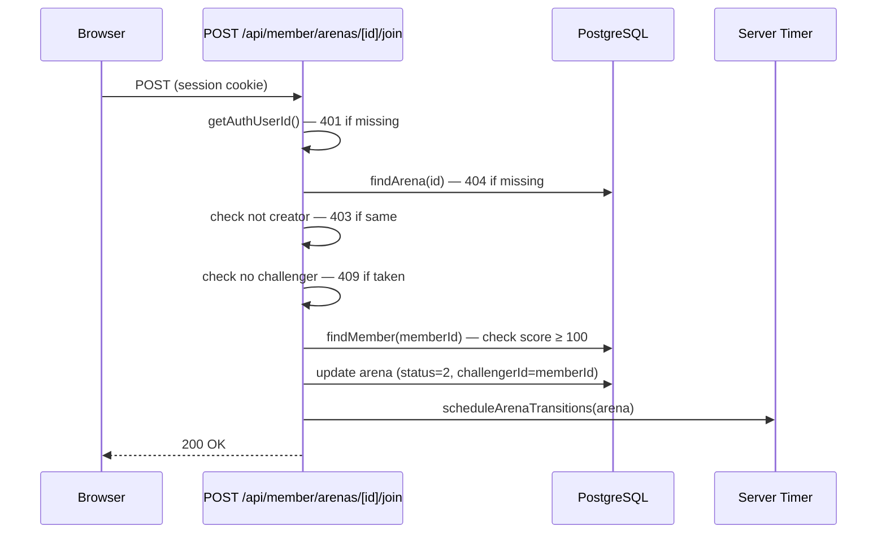
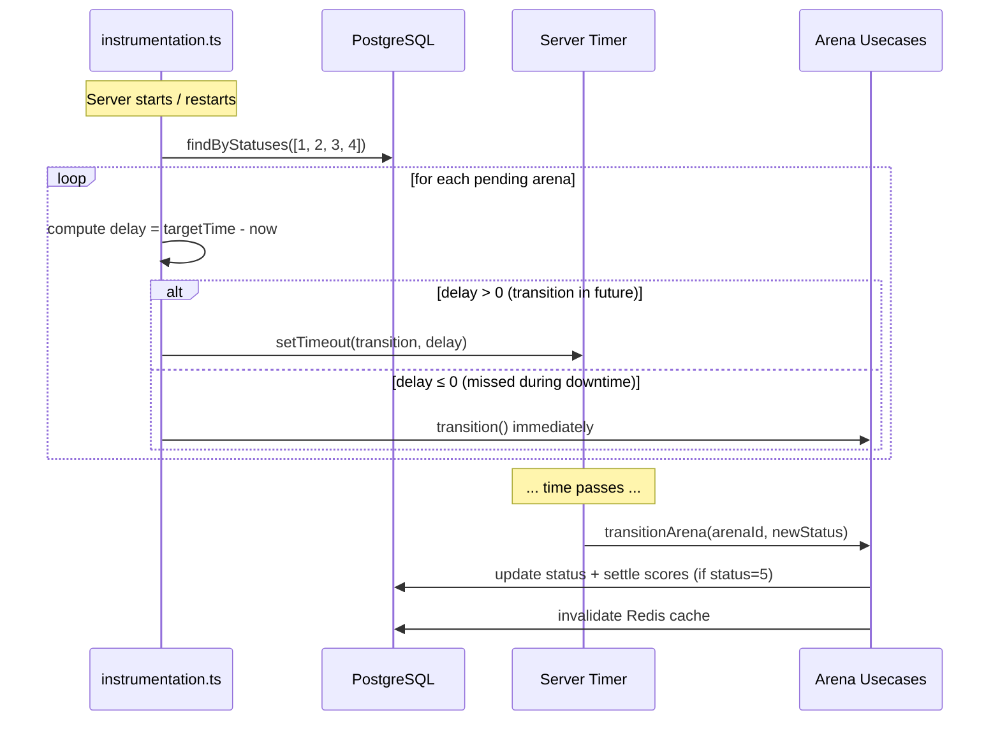
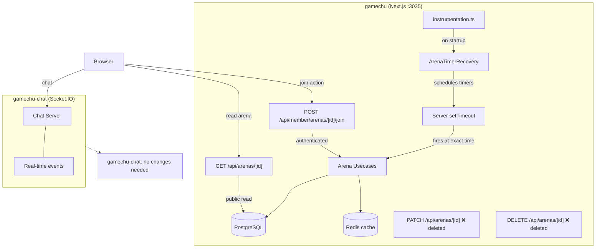

# Security Fix Plan

Generated: 2026-04-07
Scanner: ECC Security Reviewer
Total issues: 10 (3 critical, 5 high, 2 medium)

---

## Overview

Issues are ordered by severity. Each entry explains the real-world impact, shows the exact broken code, and provides a concrete fix.

---

## CRITICAL-1: Hashed Password in API Response

**File:** `backend/member/application/usecase/GetMemberProfileUsecase.ts:12`
**File:** `backend/member/application/usecase/dto/MemberProfileResponseDto.ts:5`

### Why it matters

Every call to `GET /api/member/profile` returns the user's bcrypt password hash in the JSON body. While bcrypt hashes cannot be reversed directly, leaking them:

- Enables offline dictionary attacks — an attacker who intercepts a single response can run billions of password guesses against the hash with no rate limiting
- Exposes the bcrypt cost factor, revealing whether the hashing is weak
- Violates the principle that credentials must never leave the server under any circumstances

A user visiting their own profile page causes their browser (and any network proxy, log, or DevTools) to receive their password hash in plain JSON.

### Broken code

```ts
// GetMemberProfileUsecase.ts
return new MemberProfileResponseDto(
    member.nickname,
    member.password,   // ← hash sent to client
    member.email,
    ...
);

// MemberProfileResponseDto.ts
export class MemberProfileResponseDto {
    constructor(
        public nickname: string,
        public password: string,  // ← declared in DTO
        ...
    ) {}
}
```

### Fix

Remove `password` from the DTO entirely. It has no legitimate use on the client.

```ts
// MemberProfileResponseDto.ts — remove password field
export class MemberProfileResponseDto {
    constructor(
        public nickname: string,
        public email: string,
        public imageUrl: string,
        public birthDate: string,
        public isMale: boolean,
        public score: number,
        public createdAt: string
    ) {}
}

// GetMemberProfileUsecase.ts — remove member.password argument
return new MemberProfileResponseDto(
    member.nickname,
    member.email,
    member.imageUrl,
    member.birthDate.toISOString(),
    member.isMale,
    member.score,
    member.createdAt.toISOString()
);
```

---

## CRITICAL-2: Arena PATCH Has No Ownership Check

**File:** `app/api/member/arenas/[id]/route.ts:20`

### Why it matters

`PATCH /api/member/arenas/:id` confirms the caller is authenticated but never checks whether the caller is the creator or challenger of that arena. Any logged-in user can:

- Change the `description` or `startDate` of any other user's arena
- Inject themselves (or any user ID) as `challengerId` of any arena they didn't create — bypassing the score-100 requirement check that lives in the _other_ arena PATCH route
- Effectively take over any open arena slot

This is a classic IDOR (Insecure Direct Object Reference) — the ID in the URL is trusted without verifying the relationship between the caller and the resource.

### Broken code

```ts
// app/api/member/arenas/[id]/route.ts
const memberId: string | null = await getAuthUserId();
if (!memberId) {
    return NextResponse.json({ message: "투기장 변경 권한이 없습니다." }, { status: 401 });
}
// ← no check: does memberId own/participate in arenaId?

const updateArenaDto: UpdateArenaDto = {
    id: arenaId,
    challengerId: validated.data.challengerId,  // ← caller sets this freely
    ...
};
await updateArenaUsecase.execute(updateArenaDto);
```

### Fix

Use distinct status codes for unauthenticated vs unauthorized. Fetch the arena first and verify membership before executing the update.

```ts
// 1. Check authentication — 401 so the client can redirect to login
const memberId: string | null = await getAuthUserId();
if (!memberId) {
    return NextResponse.json(
        { message: "로그인이 필요합니다." },
        { status: 401 }
    );
}

// 2. Check resource exists
const arenaRepository: ArenaRepository = new PrismaArenaRepository();
const arena = await arenaRepository.findById(arenaId);
if (!arena) {
    return NextResponse.json(
        { message: "투기장이 존재하지 않습니다." },
        { status: 404 }
    );
}

// 3. Check ownership — 403 (authenticated but not a participant)
if (arena.creatorId !== memberId && arena.challengerId !== memberId) {
    return NextResponse.json(
        { message: "투기장 변경 권한이 없습니다." },
        { status: 403 }
    );
}
```

**Note:** the existing DELETE handler in the same file returns 401 for the ownership check — fix that second 401 to 403 as well.

---

## CRITICAL-3: Admin Arena PATCH + DELETE Have No Authentication

**File:** `app/api/arenas/[id]/route.ts:62` (PATCH), `app/api/arenas/[id]/route.ts:140` (DELETE)

### Why it matters

These are the most dangerous endpoints in the application. With zero authentication:

- **PATCH status=5**: Any anonymous visitor can end any arena, triggering `endArenaUsecase.execute(arenaId)` which settles scores for all participants — awarding or deducting points with real game consequences
- **PATCH status=2**: Any anonymous visitor can forcibly assign any `challengerId` to any arena, bypassing the 100-score minimum requirement
- **DELETE**: Any anonymous visitor can delete any arena and trigger score settlement

An attacker just needs the arena ID (visible in the URL on any arena page) and can send a single `PATCH { "status": 5 }` to destroy the arena.

### Broken code

```ts
// app/api/arenas/[id]/route.ts — PATCH handler, line 62
export async function PATCH(req: NextRequest, { params }: RequestParams) {
    const { id } = await params;
    // ← getAuthUserId() is never called. No session check at all.
    const body = await req.json();
    ...
    await endArenaUsecase.execute(arenaId);  // triggers score settlement
}

// DELETE handler, line 140
export async function DELETE(request: Request, { params }: RequestParams) {
    // ← same — no auth check
    await endArenaUsecase.execute(arenaId);
    await deleteArenaUsecase.execute(arenaId);
}
```

### Root cause

The endpoint is not actually called by an admin or a server process — it is called by **client-side React hooks** (`useArenaAutoStatus`, `useArenaAutoStatusDetail`) running in the browser via `setTimeout`. Because those hooks have no session, the endpoint had to be left open. This is a fundamental design problem:

| Caller                      | Location                    | Problem                                        |
| --------------------------- | --------------------------- | ---------------------------------------------- |
| `useArenaAutoStatus`        | Browser (arena list page)   | Timers die when user leaves the page           |
| `useArenaAutoStatusDetail`  | Browser (arena detail page) | Same                                           |
| `ArenaDetailRecruiting.tsx` | Browser (join button)       | User action bundled with automated transitions |

The endpoint serves two completely different concerns through the same route, making it impossible to properly secure either.

### Fix: Split responsibilities

#### Part 1 — Move user join to a dedicated authenticated endpoint

`ArenaDetailRecruiting.tsx` calls `PATCH /api/arenas/[id]` with `{ status: 2, challengerId: memberId }` to join an arena. This is a user action and must require a session.

Create `POST /api/member/arenas/[id]/join`:

```ts
// app/api/member/arenas/[id]/join/route.ts
export async function POST(req: NextRequest, { params }: RequestParams) {
    const memberId = await getAuthUserId();
    if (!memberId) return errorResponse("로그인이 필요합니다.", 401);

    const arenaId = validate(IdSchema, (await params).id);
    if (!arenaId.success) return arenaId.response;

    const arena = await arenaRepository.findById(arenaId.data);
    if (!arena) return errorResponse("투기장이 존재하지 않습니다.", 404);
    if (arena.challengerId)
        return errorResponse("이미 다른 유저가 참가 중입니다.", 409);
    if (arena.creatorId === memberId)
        return errorResponse("본인이 만든 투기장에는 참가할 수 없습니다.", 403);

    const member = await memberRepository.findById(memberId);
    if (!member || member.score < 100)
        return errorResponse(
            "투기장 참여를 위해서는 최소 100점이 필요합니다.",
            403
        );

    // challengerId comes from session — not from the request body
    await updateArenaUsecase.execute({
        id: arenaId.data,
        challengerId: memberId,
        status: 2,
    });

    return NextResponse.json({ message: "참가 완료" }, { status: 200 });
}
```

> **Why not reuse `PATCH /api/member/arenas/[id]`?**
> The CRITICAL-2 fix adds an ownership gate (`creatorId === memberId || challengerId === memberId`). A user trying to join is neither — so they would always get 403. The join action has opposite authorization semantics from an ownership check and must be a separate route.

#### Part 2 — Move auto-status to server-side timers in `gamechu` (Next.js process)

Replace client-side `setTimeout` hooks with server-side timers initialized in `instrumentation.ts`. This file runs once when the Next.js server starts:

```ts
// instrumentation.ts (project root)
export async function register() {
    if (process.env.NEXT_RUNTIME === "nodejs") {
        const { recoverPendingArenaTimers } = await import(
            "@/lib/ArenaTimerRecovery"
        );
        await recoverPendingArenaTimers();
    }
}
```

```ts
// lib/ArenaTimerRecovery.ts
export async function recoverPendingArenaTimers() {
    const arenaRepo = new PrismaArenaRepository();

    // ArenaFilter only accepts a single status — query each active status separately.
    // Statuses 1-4 have pending transitions; status 5 is already ended.
    const pending = (
        await Promise.all(
            [1, 2, 3, 4].map(s =>
                arenaRepo.findAll(new ArenaFilter(s, null, "startDate", false, 0, 10_000))
            )
        )
    ).flat();

    for (const arena of pending) {
        scheduleArenaTransitions(arena);
    }
}

export function scheduleArenaTransitions(arena: Arena) {
    const now = Date.now();
    const startMs = new Date(arena.startDate).getTime();
    // debateEndDate and voteEndDate are not stored in DB — compute from startDate.
    // Matches GetArenaDetailUsecase.ts: endChatting = startDate + 30min, endVote = endChatting + 24h.
    const debateEndMs = startMs + 30 * 60 * 1000;
    const voteEndMs   = debateEndMs + 24 * 60 * 60 * 1000;

    const schedule = (targetMs: number, newStatus: ArenaStatus) => {
        const delay = Math.max(0, targetMs - now);  // fire immediately if past
        setTimeout(() => transitionArena(arena.id, newStatus), delay);
    };

    if (arena.status === 2) schedule(startMs, 3);        // 2→3 at startDate (matches useArenaAutoStatus.ts)
    if (arena.status === 3) schedule(debateEndMs, 4);    // 3→4 at startDate + 30 min
    if (arena.status === 4) schedule(voteEndMs, 5);      // 4→5 at startDate + 30 min + 24 h
    if (arena.status === 1 && !arena.challengerId) {
        schedule(startMs, "delete" as any);              // 1→delete at startDate if no challenger
    }
}

async function transitionArena(arenaId: number, newStatus: ArenaStatus | "delete") {
    // calls usecase directly — no HTTP
    const arenaRepo = new PrismaArenaRepository();
    if (newStatus === "delete") {
        await new DeleteArenaUsecase(arenaRepo).execute(arenaId);
    } else {
        await new UpdateArenaStatusUsecase(...).execute({ id: arenaId, status: newStatus });
        if (newStatus === 5) await new EndArenaUsecase(...).execute(arenaId);
    }
    await redis.del(arenaDetailKey(arenaId));
    await redis.incr(ARENA_LIST_VERSION_KEY);
}
```

**Handling daily server restarts:** The server restarts every day due to network resets. `Math.max(0, delay)` ensures any transition that was due during the downtime fires immediately on startup — no transitions are silently skipped.

**`gamechu-chat` is not involved:** It handles chatting only. Arena business logic stays entirely within `gamechu`.

#### Part 3 — Delete or lock the admin HTTP endpoints

Once the cron handles all automatic transitions, `PATCH /api/arenas/[id]` and `DELETE /api/arenas/[id]` have no legitimate callers and should be deleted. The GET handler in the same file can be kept as-is.

#### Part 4 — Simplify client hooks to UI-only polling

The hooks no longer call the API — they just re-fetch arena state on an interval so the UI stays fresh after server-side transitions:

```ts
// useArenaAutoStatus.ts — after fix
useEffect(() => {
    const interval = setInterval(() => {
        queryClient.invalidateQueries({ queryKey: ["arenas"] });
    }, 30_000);
    return () => clearInterval(interval);
}, []);
```

### Flow diagram

#### Arena status lifecycle



#### User join flow



#### Server startup timer recovery (handles daily restarts)



#### Architecture: separation of concerns



---

## HIGH-1: IDOR on Wishlist Delete

**File:** `app/api/member/wishlists/[id]/route.ts:18`

### Why it matters

A logged-in user can delete any other user's wishlist entry by guessing or enumerating wishlist IDs (sequential integers are trivially enumerable). There is no check that `wishlistId` belongs to the authenticated user.

The practical impact: a malicious user can silently clear another user's entire wishlist by iterating IDs.

### Broken code

```ts
const memberId = await getAuthUserId();
if (!memberId) return errorResponse("Unauthorized", 401);

const wishlistId = parsed.data;
// ← no check: does memberId own wishlistId?
await usecase.execute(new DeleteWishlistDto(wishlistId));
```

### Fix

Change the URL parameter from `wishlistId` (PK) to `gameId`. `findById(memberId, gameId)` already scopes by the authenticated user — no extra ownership check needed. The frontend has `gameId` in scope and does not need `wishlistId` for the delete URL.

**Route (`app/api/member/wishlists/[id]/route.ts`):**

```ts
const memberId = await getAuthUserId();
if (!memberId) return errorResponse("Unauthorized", 401);

const { id } = await params; // [id] is now gameId, not wishlist PK
const parsed = validate(IdSchema, id);
if (!parsed.success) return parsed.response;
const gameId = parsed.data;

const wishlistRepo = new PrismaWishListRepository();
const wishlist = await wishlistRepo.findById(memberId, gameId);
// findById(memberId, gameId) scopes by memberId — returns null if not owned
if (!wishlist) return errorResponse("위시리스트를 찾을 수 없습니다.", 404);

const usecase = new DeleteWishlistUsecase(wishlistRepo);
await usecase.execute(new DeleteWishlistDto(wishlist.id));
```

**Frontend (`hooks/useWishlist.ts`):**

```ts
// Before: DELETE /api/member/wishlists/${current.wishlistId}
// After:  DELETE /api/member/wishlists/${gameId}   (gameId is already in hook closure)
await fetch(`/api/member/wishlists/${gameId}`, { method: "DELETE" });
```

---

## HIGH-2: Score Endpoint Ignores Validated Body

**File:** `app/api/member/scores/route.ts:40`

### Why it matters

`POST /api/member/scores` validates `policyId` and `actualScore` from the request body, but then ignores both fields and hard-codes `result: "JOIN"`. This means:

1. Any authenticated user can call this endpoint repeatedly, each time applying a JOIN score penalty to themselves — the endpoint has no idempotency check and no rate limiting
2. The validated body is dead code — it gives a false sense of security while providing no actual constraint
3. If a future developer changes the hard-coded `"JOIN"` to use `validated.data.policyId`, the endpoint becomes exploitable for arbitrary score manipulation

The endpoint likely exists as an incomplete migration artifact (the `// TODO: apply refactored usecase` comment confirms this).

### Fix

This endpoint should either be removed (score application happens server-side when arenas end) or locked down:

```ts
// Option A — Remove the POST handler entirely if score application
// is only triggered by arena end logic (recommended)

// Option B — If keeping it, add idempotency + rate limiting
const existing = await scoreRecordRepo.findByMemberAndArena(memberId, arenaId);
if (existing) return errorResponse("이미 처리된 요청입니다.", 409);
```

---

## HIGH-3: Unauthenticated Notification Creation

**File:** `app/api/notification-records/route.ts:11`

### Why it matters

`POST /api/notification-records` requires no session. Any unauthenticated visitor who knows a valid `memberId` (a UUID, but UUIDs can be obtained from public arena/profile pages) can spam arbitrary notifications into any user's notification feed with any `description` text.

This enables:

- Notification spam / social engineering attacks against users
- Abuse of the notification system to send misleading messages (e.g., fake "You won the arena!" notifications)

### Broken code

```ts
export async function POST(request: Request) {
    // ← no getAuthUserId() call
    const { memberId, typeId, description } = parsed.data;
    // memberId comes from the request body — caller can set it to anyone
    await createNotificationRecordUsecase.execute(...);
}
```

### Fix

Two options depending on who calls this endpoint:

**Option A — Called by the authenticated user for themselves:**

```ts
const callerId = await getAuthUserId();
if (!callerId) return errorResponse("Unauthorized", 401);

// Ignore body memberId — use authenticated caller's ID
const createDto = new CreateNotificationRecordDto(
    callerId,
    typeId,
    description
);
```

**Option B — Internal server-to-server call (e.g., triggered by arena end):**
Move this to a direct server-side function call instead of an HTTP endpoint. Delete the route entirely and call `createNotificationRecordUsecase.execute()` directly from the arena end handler.

Option B is recommended based on the codebase pattern.

---

## HIGH-4: IP Spoofing Bypasses Rate Limiter

**File:** `lib/RateLimiter.ts:69`

### Why it matters

`getClientIp()` reads the `x-forwarded-for` header directly from the request. This header is set by the client — anyone can send `x-forwarded-for: 1.2.3.4` to make every request appear to come from a different IP. This completely defeats the rate limiter on login, signup, and any other IP-keyed endpoint.

An attacker can run unlimited login attempts against any account by rotating the spoofed IP header on each request.

### Broken code

```ts
export function getClientIp(req: NextRequest): string {
    return (
        req.headers.get("x-forwarded-for")?.split(",")[0]?.trim() ?? // ← client-controlled
        req.headers.get("x-real-ip") ??
        "unknown"
    );
}
```

### Fix

The correct IP depends on your deployment infrastructure:

```ts
export function getClientIp(req: NextRequest): string {
    // Option A — Cloudflare (sets cf-connecting-ip, which clients cannot spoof)
    return req.headers.get("cf-connecting-ip") ?? "unknown";

    // Option B — Vercel / trusted proxy sets x-real-ip from the actual socket
    return req.headers.get("x-real-ip") ?? "unknown";

    // Option C — Keep x-forwarded-for but take the LAST entry (trusted proxy appends)
    const forwarded = req.headers.get("x-forwarded-for");
    if (forwarded) {
        const ips = forwarded.split(",").map((ip) => ip.trim());
        return ips[ips.length - 1]; // last = set by your proxy, not the client
    }
    return "unknown";
}
```

Choose based on your hosting provider. For Cloudflare, Option A is the most reliable.

---

## HIGH-5: CSP in Report-Only Mode

**File:** `next.config.ts:9`

### Why it matters

`Content-Security-Policy-Report-Only` tells the browser to log policy violations but **not block them**. The CSP header provides zero protection in this mode — XSS payloads that load external scripts will execute successfully while the header silently logs to the console.

### Broken code

```ts
{
    key: "Content-Security-Policy-Report-Only",  // ← does nothing to stop attacks
    value: "default-src 'self'; script-src 'self'; ..."
}
```

### Fix

Change the header key to enforce the policy. Before doing so, verify the policy doesn't break any legitimate app functionality (Socket.IO WebSocket connections, image CDNs, etc.):

```ts
{
    key: "Content-Security-Policy",  // ← now enforced
    value: [
        "default-src 'self'",
        "script-src 'self'",
        "style-src 'self' 'unsafe-inline'",
        "img-src 'self' data: https:",
        "font-src 'self'",
        "connect-src 'self' ws: wss:",
    ].join("; "),
}
```

**Note:** Test this in a staging environment first. If Next.js inlines scripts (e.g., for hydration), `script-src 'self'` may need `'nonce-...'` or `'unsafe-inline'` temporarily. Run the app with Report-Only in staging, check the console for violations, then adjust before switching to enforced.

---

## MEDIUM-1: Unvalidated imageUrl Domain

**File:** `backend/member/application/usecase/dto/UpdateProfileRequestDto.ts:7`

### Why it matters

`imageUrl` is validated as a syntactically valid URL but with no domain restriction. A user can set their profile image to any URL including:

- `http://169.254.169.254/latest/meta-data/` (AWS metadata endpoint — SSRF)
- `http://localhost:6379` (Redis)
- `http://internal-service/admin`

If any backend code ever fetches this URL (for thumbnails, avatar caching, etc.), this becomes a Server-Side Request Forgery attack. Even without server-side fetching today, storing arbitrary URLs in the DB is a bad pattern that creates future risk.

### Fix

Add a domain allow-list to the schema that mirrors `next.config.ts`'s `remotePatterns`:

```ts
const ALLOWED_IMAGE_HOSTNAMES = [
    "i.imgur.com",
    "ko.imgbb.com",
    "i.namu.wiki",
    "images.igdb.com",
    "cdn.cloudflare.steamstatic.com",
];

export const UpdateProfileSchema = z.object({
    ...
    imageUrl: z.string().url("올바른 URL 형식이 아닙니다.")
        .refine(
            (url) => {
                try {
                    const { hostname } = new URL(url);
                    return ALLOWED_IMAGE_HOSTNAMES.includes(hostname);
                } catch {
                    return false;
                }
            },
            { message: "허용되지 않은 이미지 도메인입니다." }
        )
        .optional(),
});
```

---

## MEDIUM-2: No Rate Limiting on Score-Mutating Endpoints

**Files:**

- `app/api/member/attend/route.ts`
- `app/api/member/review-likes/[reviewId]/route.ts`
- `app/api/member/scores/route.ts`

### Why it matters

These endpoints mutate a member's score. Without rate limiting, an authenticated user can call them in a tight loop. The attendance endpoint has a date-based idempotency check (effectively rate-limited to once per day), but `review-likes` and `scores` do not. A user can toggle a review like hundreds of times per second, generating score record entries for each toggle.

### Fix

Apply the existing `RateLimiter` (already used on auth endpoints) with a per-user key. Since `memberId` is always available, use it instead of IP to avoid the IP-spoofing issue (HIGH-4):

```ts
// Example for review-likes
import { RateLimiter } from "@/lib/RateLimiter";

const reviewLikeLimiter = new RateLimiter("review-like", 60_000, 30); // 30/min per user

export async function POST(req: NextRequest, { params }) {
    const userId = await getAuthUserId();
    if (!userId) return errorResponse("Unauthorized", 401);

    const limitResult = await reviewLikeLimiter.check(userId);
    if (!limitResult.allowed) {
        return rateLimitResponse(limitResult.retryAfterMs);
    }
    ...
}
```

For `attend`, the existing date check is sufficient — rate limiting would be redundant.

---

## Implementation Order

| Priority | Issue                                                                                                            | Effort        | Impact   |
| -------- | ---------------------------------------------------------------------------------------------------------------- | ------------- | -------- |
| 1        | CRITICAL-3: Add `POST /api/member/arenas/[id]/join`, move timers to `instrumentation.ts`, delete admin endpoints | High          | Critical |
| 2        | CRITICAL-1: Remove password from profile DTO                                                                     | Low (2 files) | Critical |
| 3        | CRITICAL-2: Add ownership check to member arena PATCH                                                            | Low           | Critical |
| 4        | HIGH-1: Add ownership check to wishlist DELETE                                                                   | Low           | High     |
| 5        | HIGH-3: Protect notification-records POST                                                                        | Low           | High     |
| 6        | HIGH-4: Fix IP detection in RateLimiter                                                                          | Low           | High     |
| 7        | HIGH-5: Switch CSP to enforced mode                                                                              | Low (1 word)  | High     |
| 8        | HIGH-2: Remove or lock down scores POST                                                                          | Medium        | High     |
| 9        | MEDIUM-1: Add imageUrl domain allow-list                                                                         | Low           | Medium   |
| 10       | MEDIUM-2: Add rate limiting to review-likes/scores                                                               | Medium        | Medium   |
